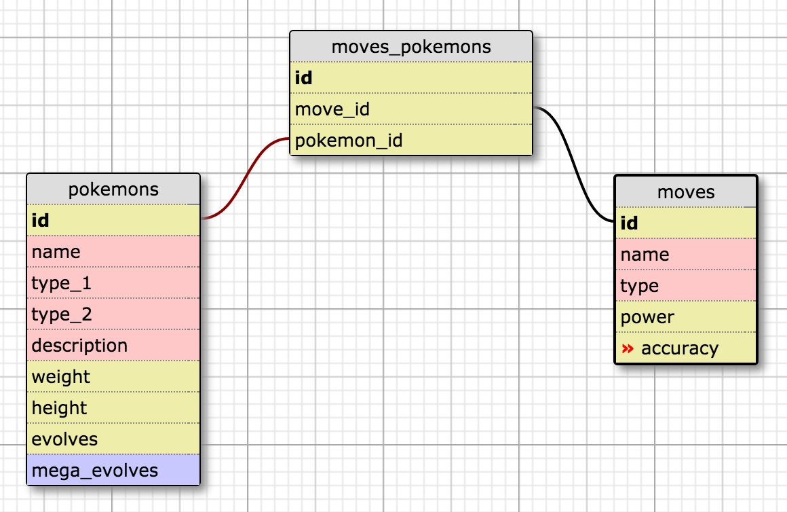

# _Pokedex_

#### _A Java web app that stores the original 151 Pokemon in the Pokedex (using SQL database) along with their moves which are used in a separate battle mode game._

#### By _**Peter Beach, Adam Craig, Ashley Maceli and Kyle Wolfson**_

## DISCLAIMER

_We do not own the images used in this web app._
_We own no copyrighted or trademarked material herein._
_All rights belong to their respective owners._

## Description

_A Java web app that stores the original 151 Pokemon in the Pokedex (using SQL database) along with their moves which are used in a separate battle mode game. In the Pokedex, can view all Pokemon and view their individual pages for more details. In the Pokedex, the user can filter Pokemon based on name, move, type and ideal enemies to fight. In the battle mode game, players choose one of the 151 Pokemon and use their moves with various power and accuracy levels. Pokemon and Moves have a many-to-many relationship in the SQL database._

##Database Tables

## Setup/Installation Requirements

* _SETTING UP THE DATABASE AND TEST DATABASE_
* _Clone repository to desktop_
* _Use console to enter directory with all files_
* _In a new console window run the command 'postgres' and keep running_
* _In a new console window run the command 'psql' then 'CREATE DATABASE pokedex;'_
* _In the same console window run the command 'psql' then 'CREATE DATABASE pokedex_test;'_
* _In bash console run the command 'psql pokedex < pokedex.sql' to properly download the database file into the empty database you just created_
* _In the same bash console run the command 'psql pokedex_test < pokedex_test.sql' to properly download the database file into the empty database you just created_
* _(Alternative to downloading test database file: Run the command '\c pokedex' to connect to the database. To create the test database run the command 'CREATE DATABASE pokedex_test WITH TEMPLATE pokedex;')_
* _RUNNING THE WEB APP_
* _In console run the command 'gradle run'_
* _Open your browser and go to http://localhost:4567/_

## Known Bugs

_Many images on full pokedex page. Run fine when files are local but if we decide to host elsewhere will need to implement a script for a type of lazy load for images to improve performance_

## Support and contact details

_For all issues and support, please contact:
Peter Beach at peterbeach2@gmail.com
Adam Craig at ajcraig@suffolk.edu
Ashley Maceli at ashley.maceli@gmail.com
Kyle Wolfson at wolfsonk@gmail.com_

## Technologies Used

_Java, SQL, Spark, Velocity, HTML, CSS, JavaScript, Gradle, JUnit, FluentLenium_

### License

The MIT License (MIT)

Copyright (c) 2016 Peter Beach, Adam Craig, Ashley Maceli, Kyle Wolfson

Permission is hereby granted, free of charge, to any person obtaining a copy
of this software and associated documentation files (the "Software"), to deal
in the Software without restriction, including without limitation the rights
to use, copy, modify, merge, publish, distribute, sublicense, and/or sell
copies of the Software, and to permit persons to whom the Software is
furnished to do so, subject to the following conditions:

The above copyright notice and this permission notice shall be included in all
copies or substantial portions of the Software.

THE SOFTWARE IS PROVIDED "AS IS", WITHOUT WARRANTY OF ANY KIND, EXPRESS OR
IMPLIED, INCLUDING BUT NOT LIMITED TO THE WARRANTIES OF MERCHANTABILITY,
FITNESS FOR A PARTICULAR PURPOSE AND NONINFRINGEMENT. IN NO EVENT SHALL THE
AUTHORS OR COPYRIGHT HOLDERS BE LIABLE FOR ANY CLAIM, DAMAGES OR OTHER
LIABILITY, WHETHER IN AN ACTION OF CONTRACT, TORT OR OTHERWISE, ARISING FROM,
OUT OF OR IN CONNECTION WITH THE SOFTWARE OR THE USE OR OTHER DEALINGS IN THE
SOFTWARE.
